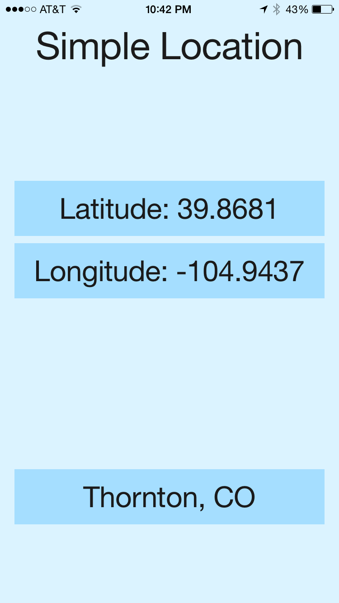

# Simple Location

A small iOS 8 application to show the user's current latitude and longitude,
as well as their city and state.

Written in Swift. Targets the iPhone 6 running iOS 8.

## Screenshot

## License

MIT

